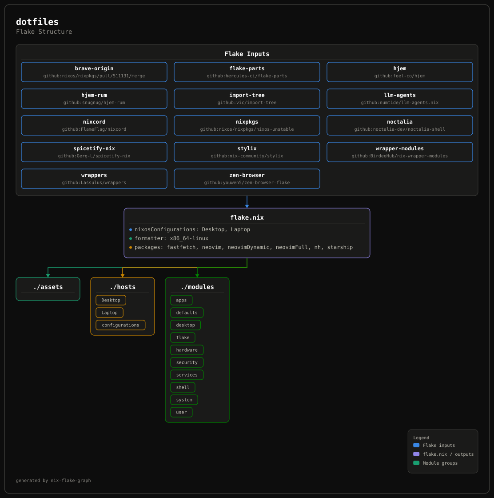
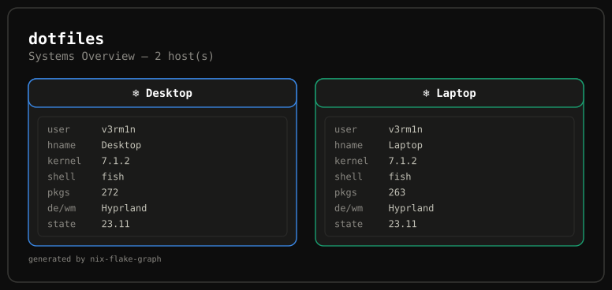

<div align="center">

# v3rm1n's NixOS Dotfiles

_Declarative NixOS configuration with Flakes_

[](https://nixos.org)
[](LICENSE)

</div>

## 📚 Overview

A modular NixOS configuration featuring Hyprland, hjem, and comprehensive system management. Built for maintainability and ease of deployment across multiple machines.

### ✨ Key Features

- 🎨 **Unified Theming** with Stylix
- 🔒 **Secure Boot** via Limine
- 🪟 **Hyprland** window manager
- 🏠 **hjem** for declarative user file management
- 📦 **Modular Architecture** with flake-parts + import-tree
- 🗄️ **Btrfs** with automatic maintenance
- ⚡ **Optimized** for both desktop and laptop configurations

## 💻 System Information

### Software Stack

| Component          | Implementation                        |
| ------------------ | ------------------------------------- |
| **OS**             | NixOS Unstable                        |
| **Display Server** | Wayland                               |
| **Window Manager** | Hyprland                              |
| **Panel**          | noctalia-shell                        |
| **Terminal**       | Ghostty                               |
| **Shell**          | Zsh with Powerlevel10k                |
| **Editor**         | Neovim + VSCode                       |
| **Browser**        | Librewolf (Desktop) / Helium (Laptop) |
| **File Manager**   | Nautilus                              |
| **Theme**          | Stylix (gruvbox-dark-hard)            |
| **Filesystem**     | Btrfs with auto-scrub                 |

## Graphs
<details>
<summary>📊 Diagrams</summary>





</details> 

## 🧭 Guide

### Prerequisites

- Nix with `flakes` and `nix-command` experimental features enabled
- `git` (or `jj`, this repo is a colocated git+jj checkout)

### Adding a New Host

1. Create `hosts/<Name>/<Name>.nix` defining `flake.modules.nixos."host/<Name>"` — set `userOptions` (browser, colorScheme, dots, hostName, username, wallpaper) and toggle whichever `mods.*` options you want (see `hosts/Desktop/Desktop.nix` / `hosts/Laptop/Laptop.nix` for reference).
2. Create `hosts/<Name>/hardware-configuration.nix` contributing to the same `"host/<Name>"` key with the machine's real `fileSystems`, bootloader, and kernel modules (generate one with `nixos-generate-config` on the target machine).
3. Register the host in `hosts/configurations.nix`:
   ```nix
   flake.nixosConfigurations = {
     <Name> = mkHost "<Name>";
   };
   ```
4. Apply it with the commands in the System Management section below.

### 💿 Fresh Install via ISO

For bootstrapping brand-new hardware, this flake can build its own installer media with the dotfiles baked in:

1. Build an installer image:
   ```sh
   nix build .#nixosConfigurations.iso-gnome.config.system.build.isoImage    # graphical, GNOME-based
   nix build .#nixosConfigurations.iso-minimal.config.system.build.isoImage  # console-only
   ```
   Both are stock NixOS installer environments — nothing from this flake runs on the live system itself.
2. Flash the resulting `.iso` (in `result/iso/`) to a USB drive and boot the target machine from it.
3. Partition, format, and mount your disks as usual, then generate a hardware profile:
   ```sh
   nixos-generate-config --root /mnt
   ```
4. The flake is baked onto the live image at `/etc/dotfiles`, but that's a symlink into the (read-only) Nix store, so it can't be edited in place — and on the graphical installer you're auto-logged in as the unprivileged `nixos` user, not root, so you'll need `sudo` besides. Become root and copy it to a writable location first:
   ```sh
   sudo -i
   cp -r /etc/dotfiles /tmp/dotfiles
   chmod -R u+w /tmp/dotfiles
   ```
5. Copy the generated `hardware-configuration.nix` into a host directory in the writable copy (either flesh out `hosts/Template` with it, or add a new host per the steps above), so it contributes `fileSystems`/bootloader options to that host's `"host/<Name>"` module.
6. Install from the writable copy:
   ```sh
   nixos-install --flake /tmp/dotfiles#<Name>
   ```
7. Reboot into the new system and continue with the commands below.

## 🛠️ System Management

### Common Commands

| Command                                    | Description                                        |
| ------------------------------------------ | -------------------------------------------------- |
| `os`                                       | Apply system changes (alias for `nh os switch -a`) |
| `ou`                                       | Update flake inputs and apply changes              |
| `nix fmt`                                  | Format all Nix files                               |
| `nix flake check`                          | Validate flake configuration                       |
| `sudo nixos-rebuild test --flake .#<host>` | Test configuration without switching               |
| `sudo nixos-rebuild boot --flake .#<host>` | Build and set for next boot                        |

## 📜 License

WTFPL — Do What the Fuck You Want to Public License.

<div align="center">

_Built with ❤️ and lots of ☕_

</div>
